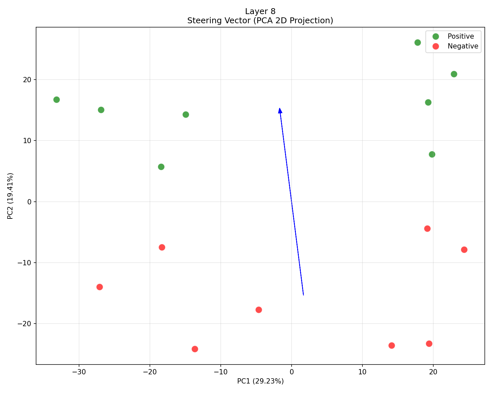

# 🧠 GPT-2 Active Steering 实验

> 在 GPT-2 (124M) 上控制模型输出情感倾向（赞美 vs 批评）

---

## 📱 手机查看完整报告

**[📄 点击打开带数学公式的完整报告 (225KB)](https://ericailab2026-droid.github.io/steering-exp/report_final.html)**

该报告包含：
- ✅ 数学公式详解（Active Steering 核心公式、Steering Vector 提取方法、Silhouette 评估）
- ✅ 三层可视化对比（Layer 4/6/8，含高清 PCA 图）
- ✅ 干预效果分析（不同 α 值的输出对比）
- ✅ 下一步改进计划

---

## 📊 实验概览

| 指标 | 值 |
|------|------|
| **最佳层** | Layer 8 (Silhouette = 0.291) |
| **测试层数** | 3 层 (4, 6, 8) |
| **正/负样本** | 各 8 条 |
| **α 测试范围** | 0, 3, 6, 10, 15, -6, -10 |
| **模型** | GPT-2 Small (124M, 12 层, 768 维) |

---

## 📈 Layer 8 可视化（最佳效果）

<div align="center">
  
</div>

- **绿色** = 正样本（赞美）
- **红色** = 负样本（批评）
- **蓝色箭头** = Steering Vector
- **Silhouette 分数**: 0.291（线性可分性中等）

---

## 🎯 关键发现

### ✅ 成功之处
- 流程跑通：完整实现 `数据 → 提取 → 生成 → 可视化`
- 向量有效：成功提取方向向量（norm = 10.0）
- 效果可见：α = 10 时模型重复"unique"，说明 steering 生效

### ⚠️ 发现的问题
| 问题 | 描述 |
|------|------|
| **样本不纯** | 混杂"商业成功/失败"概念而非纯情感 |
| **α 范围需调优** | α ≤ 6 效果不明显，α ≥ 10 模型崩坏，最佳在 3-6 |
| **负向不满足** | α = -6 输出政治内容而非纯粹批评 |

---

## 📐 数学原理

### Active Steering 核心公式

$$ h'_{l} = h_{l} + \alpha \cdot v $$

其中：
- $ h_{l} $: 第 $ l $ 层的原始隐藏状态（768 维）
- $ h'_{l} $: 干预后的隐藏状态
- $ \alpha $: 干预强度系数
- $ v $: Steering Vector（正负样本平均激活之差）

### Steering Vector 提取方法

$$ v_{l} = \text{mean}(A^{+}_{l}) - \text{mean}(A^{-}_{l}) $$

### 线性可分性评估（Silhouette）

$$ \text{Silhouette} = \frac{b - a}{\max(a, b)} $$

---

## 🔄 下一步改进计划

- [ ] **重新设计纯净样本**（只含"brilliant/terrible"等纯情感词）
- [ ] **重新提取 Steering Vector**
- [ ] **小范围测试 α=1,2,3,4,5**（寻找最佳范围）
- [ ] **Layer 6 vs Layer 8 对比测试**
- [ ] **添加 VADER 自动情感评分**

---

## 📁 文件结构

```
steering-exp/
├── report_final.html              # 完整数学可视化报告 (225KB)
├── report_v2_math.html            # 模板文件
├── README.md                      # 你正看到的 repo 首页
├── images/
│   ├── layer4_pca.png             # Layer 4 PCA 图 (52KB)
│   ├── layer6_pca.png             # Layer 6 PCA 图 (54KB)
│   └── layer8_pca.png             # Layer 8 PCA 图 (52KB)
├── steering_data.py               # 实验样本数据（8 正 +8 负）
├── extract_vector.py              # 向量提取脚本
├── steer_generation.py            # 生成测试脚本
├── generation_results.json        # 生成结果记录 (8KB)
├── experiments.md                 # 详细实验笔记 (4KB)
├── best_steer_vector_layer8.pt    # 最佳 Steering Vector (5KB)
├── all_layers_results.pt          # 所有层激活数据 (181KB)
└── .github/workflows/pages.yml    # GitHub Pages 部署配置
```

---

## 🚀 快速开始

```bash
# 环境已配置好
cd ~/projects/interp-lab/steering-exp
source venv/bin/activate

# 重新提取向量
python extract_vector.py

# 测试生成
python steer_generation.py

# 查看结果
cat generation_results.json
```

---

## 📱 手机查看说明

| 内容 | 查看方式 |
|------|------|
| **完整数学报告** | 点击顶部链接 [report_final.html](https://ericailab2026-droid.github.io/steering-exp/report_final.html) |
| **PCA 图片** | 点击 repo 中的 `images/` 文件夹 |
| **实验脚本** | 点击文件名，点击 "Raw" 查看 |
| **数据文件** | 点击文件名下载 |

---

## 📋 实验记录

**更新时间**: 2026-04-25 12:41  
**状态**: 第二轮改进进行中  
**下次汇报**: 13:11

---

**自动更新 by Hermes Agent** | [Active Steering 实验系列]
